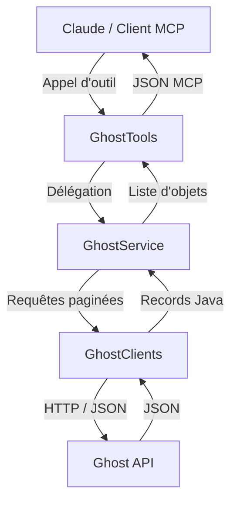
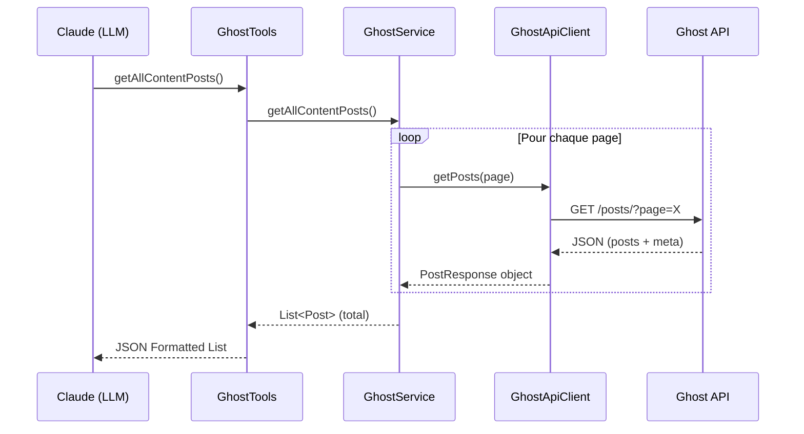

# Ghost MCP Server

[](https://github.com/ErwanLT/ghost-mcp-server/actions/workflows/maven.yml)


[](https://www.oracle.com/java/technologies/javase/jdk25-archive-downloads.html)
[](https://spring.io/projects/spring-boot)
[](https://modelcontextprotocol.io)

Un serveur **Model Context Protocol (MCP)** robuste et performant permettant aux LLM (comme Claude) d'interroger et d'interagir avec les instances [Ghost.io](https://ghost.org/). Il supporte nativement les API **Content** et **Admin**.

## 🌟 Points Forts

- 🚀 **Performance** : Utilisation de `WebClient` réactif et filtrage intelligent des champs.
- 📑 **Pagination Intelligente** : Gestion transparente de la pagination Ghost pour garantir des résultats complets.
- 🔒 **Sécurité** : Authentification via JWT pour l'API Admin et gestion sécurisée des clés via variables d'environnement.
- 🛠️ **Modulaire** : Activation conditionnelle des outils en fonction des clés API fournies.
- ✅ **Configuration validée** : Contrôle de l'URL Ghost, des clés API et du format de clé Admin au démarrage.
- 🧯 **Erreurs lisibles** : Gestion explicite des erreurs HTTP, timeouts, rate limits et réponses trop volumineuses.
- 📚 **Richesse des données** : Inclusion systématique des tags et auteurs pour un contexte maximal.

## 🏗️ Architecture & Structure

Le projet suit une architecture propre en couches permettant une séparation nette des responsabilités :



### Flux d'exécution (Séquence)



### Organisation des packages
- `client/` : Clients HTTP (`WebClient`) pour les API Admin et Content.
- `service/` : Couche métier gérant l'agrégation des données et la pagination.
- `tools/` : Définition des outils MCP exposés au LLM via `@Tool`.
- `models/` : Enregistrements (Records) Java pour une désérialisation type-safe.
- `configuration/` : Configuration Spring Boot, MCP et propriétés.

## 🚀 Installation & Build

### Prérequis

- **Java 25** ou supérieur.
- **Maven 3.9+**.

### Build

```bash
mvn clean package
```

Le fichier JAR sera généré dans `target/ghost-mcp-server-0.0.1-SNAPSHOT.jar`.

## ⚙️ Configuration Claude Desktop

Ajoutez cette configuration à votre fichier `claude_desktop_config.json` (souvent situé dans `~/Library/Application Support/Claude/` sur macOS) :

```json
{
  "mcpServers": {
    "ghost-mcp-server": {
      "command": "java",
      "args": [
        "-Dio.netty.noUnsafe=true",
        "--enable-native-access=ALL-UNNAMED",
        "-jar",
        "[CHEMIN_VERS_VOTRE_PROJET]/target/ghost-mcp-server-0.0.1-SNAPSHOT.jar"
      ],
      "env": {
        "GHOST_URL": "https://votre-blog.ghost.io",
        "GHOST_ADMIN_API_KEY": "VOTRE_ADMIN_API_KEY",
        "GHOST_CONTENT_API_KEY": "VOTRE_CONTENT_API_KEY",
        "GHOST_LOG_FILE": "[CHEMIN_VERS_VOTRE_PROJET]/src/logs/mcp-server.log"
      }
    }
  }
}
```

### Variables d'environnement

| Variable | Description | Obligatoire |
| :--- | :--- | :--- |
| `GHOST_URL` | URL de base de votre instance Ghost. | **Oui** |
| `GHOST_ADMIN_API_KEY` | Clé API Admin (Format `id:secretHexadecimal`). Active les outils Admin. | Non |
| `GHOST_CONTENT_API_KEY` | Clé API Content. Active les outils Content. | Non |
| `GHOST_LOG_FILE` | Chemin complet pour le fichier de logs. | Non |

Au moins une clé API (`GHOST_ADMIN_API_KEY` ou `GHOST_CONTENT_API_KEY`) doit être fournie pour exposer des outils MCP.

## 🛠️ Outils Disponibles

### 📖 API Content
*Activée si `GHOST_CONTENT_API_KEY` est définie.*

- `getAllContentPosts` : Liste tous les articles publics et publiés.
- `getContentPostById(id)` : Récupère le contenu complet d'un article via son ID.
- `getContentPostBySlug(slug)` : Récupère le contenu complet via son slug URL.
- `getAllAuthors` : Liste les auteurs ayant publié des articles.
- `getAllTags` : Liste tous les tags du site.

### 🔐 API Admin
*Activée si `GHOST_ADMIN_API_KEY` est définie.*

- `getAllAdminPosts` : Accès à **tous** les articles (Publics, Brouillons, Planifiés).
- `findAdminPostsByAuthor(author)` : Filtre les articles par auteur.
- `findAdminPostsByTag(tag)` : Filtre les articles par tag.
- `getAdminPostBySlug(slug)` : Détails complets incluant les métadonnées administratives.

## 🧪 Tests

Le projet inclut une suite de tests unitaires et d'intégration utilisant `MockWebServer` pour simuler les réponses Ghost.

```bash
mvn test
```

## 📦 Release

Le projet utilise le `maven-release-plugin` pour préparer les versions et créer les tags Git.

```bash
mvn release:prepare
```

Le tag créé suit le format `vX.Y.Z` (par exemple `v2.0.0`). La GitHub Release est ensuite créée manuellement à partir du tag ; le workflow GitHub Actions publie alors automatiquement le package Maven dans GitHub Packages.

## 🔍 Troubleshooting

- **Logs** : Consultez le fichier défini dans `GHOST_LOG_FILE` pour diagnostiquer les erreurs de connexion.
- **Authentification** : Si les outils Admin échouent, vérifiez que votre `GHOST_ADMIN_API_KEY` respecte bien le format `id:secretHexadecimal`.
- **Rate limit** : En cas de limite API Ghost atteinte, le serveur retourne une erreur explicite invitant à réessayer plus tard.
- **Timeout** : Les appels Ghost sont limités dans le temps afin d'éviter qu'un outil MCP reste bloqué indéfiniment.
- **Mémoire** : En cas de très gros volumes de données, le `maxInMemorySize` du WebClient est configuré à 2MB par défaut.
